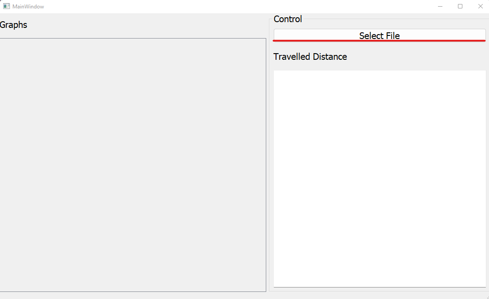
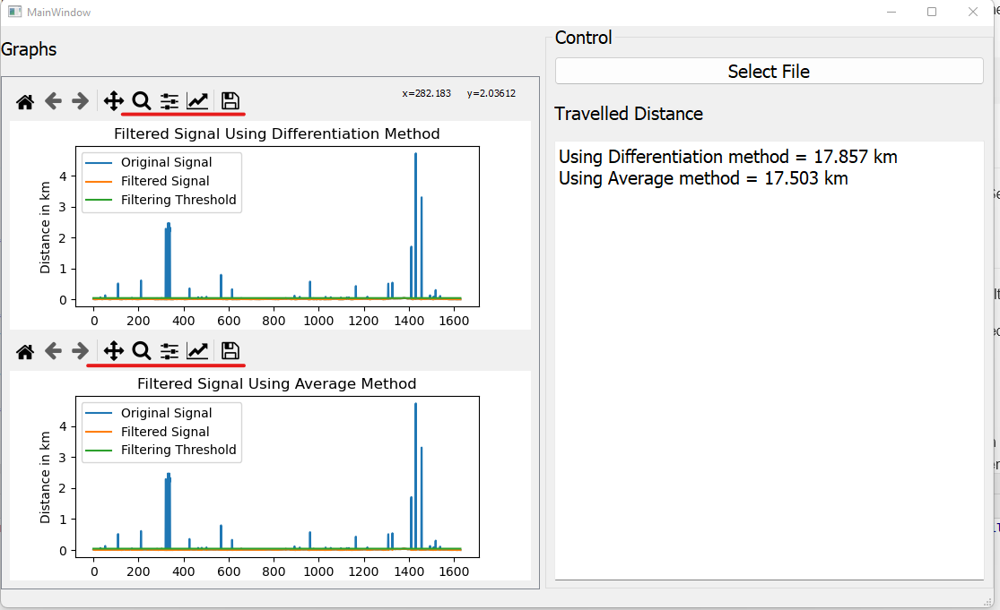
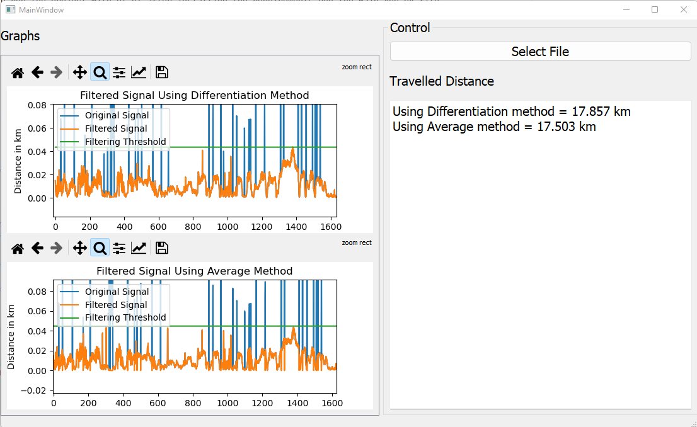
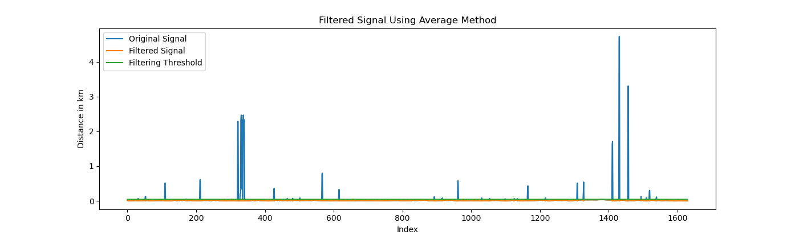
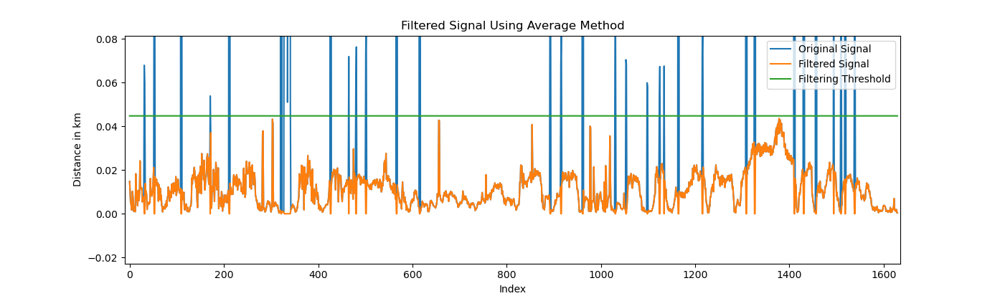
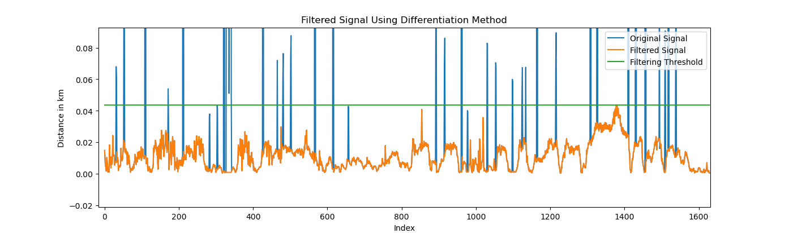

# KML_Flirting 

This project is used to read the coordinates contained in the KML file and to filter the noise. Finally, the project calculates the distance travelled in km.
## Getting started

Install required packages  using the following command 

```
pip install -r requirements.txt
```
To run the project with Qt UI after installing the requirements run the Main_App.py file 

```
python ./Main_App.py
```

If you wish to run the Filtering and the processing part without the UI, use the following command

```
python KMLProcessor.py --file_path path/to/ur_file.kml
```

## Packages Used

- **pykml1:** This package is used to read the kml file

- **geopy:** This package is used to calcaulate the distance between each two coordinates point.

- **Numpy:** This package is used to perform some mathmatical operation such as differentiation.

- **matplotlib:** This package is used to draw the graphs

- **PyQt5:** This package is used to develop the GUI.

## Demo Example 
- First, run the project and click "Select File"



- The results will show after you select the file


- You can use the highlighted toolbar to edit the graph display.For example, you may use the toolbar to zoom into the Graph as shown below.


## Description
The program uses two methods to filter the noise in the given KML file.

* **Note: Method 2 is considered as the final Method, however Method 1 was added to show a simple comparison.** 

###Method1: (Using Average)

   - First, the distance between each point is obtained using geopy Library. 
   - All the 0 distance will then be removed
   - After that, we will obtain the average and use it as threshold. 
   - Each value that is greater than the threshold will be replaced with zero
   
The output is shown below


The zoomed Version is shown below


### Advantages

   - Very Simple 
   
### Disadvantages

- This method will not work for most of the cases as the threshold was obtained in a good range due to the high noises, which will not happen every time
- The Distance should not be replaced with Zeros but the average instead


### Total distance travelled 
17.503 km


###Method2:  (Using Differentiation)

   - First, the distance between each point is obtained using geopy Library. 
   - All the 0 distance will than be removed
   - After that we obtain differentiation of the array using numpy. 
   - The Average of the absolote differentiation array will than be used as a threshold 
   - Each value that is greater than the threshold in the differentiation array will be replaced in the original array  with the average of last two points or the next two points.
   


The output is shown below


The zoomed Version is shown below


**Note that the green graph is not the actual thrshold in this case, it has been display for visual checking that is all. And it is actuall the maximum distance in the filtered array.**

### Advantages

   - The noise detection is based on differentiation of the array which is more roubest to detect noise
   - The results is more accurate since the average is taken instead of replacing with zero
   
### Disadvantages

   - More complex than using the simple average method


### Total distance travelled 
17.857 km

## Authors and acknowledgment
This project was completed by  Abdelsalam Hamdi


